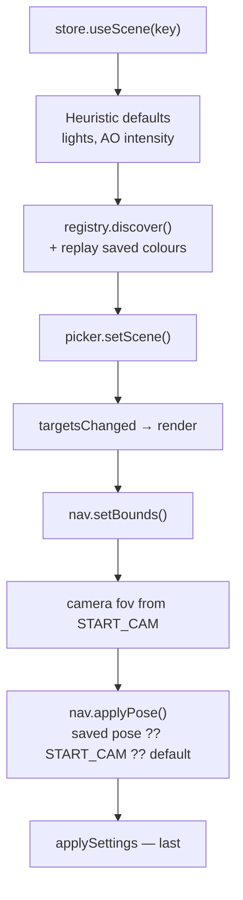
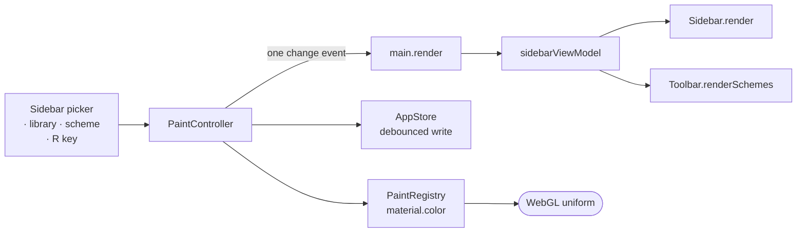

# Architecture overview

Repaint is a single-page, single-canvas app with no backend. A GLB is read in the
browser with `FileReader`, parsed by three.js, and recoloured in place. All state
persists to `localStorage`.

This document covers the components, how a colour change travels through them,
and which seams exist so the pipeline can be tested without a GPU. The reasoning
behind individual choices lives in [decisions/](decisions/).

## Components

```text
src/
  main.ts                  App — wiring, shortcuts, persistence, screenshots
  sidebarViewModel.ts      Gathers what the sidebar should show into one plain
                           object; no DOM, so it is directly assertable
  types.ts                 Shared types; PAINT_ prefix and START_CAM name
  core/
    Viewer.ts              Renderer, camera, frame loop, environment, tone mapping
    SceneLoader.ts         GLB → LoadedScene, disposal, load report
    SceneSession.ts        Scene activation: prefs, discovery, picker, camera
    loaders.ts             GLTFLoader + DRACO / KTX2 / meshopt
    processScene.ts        Renderer-free: lightmap wiring, bounds, START_CAM, stats
    PaintRegistry.ts       Discovery + the single write path for material.color
    PaintController.ts     The paint fan-out: registry + store + one change event
    Picker.ts              Raycast hover/select, emissive highlight
    materials.ts           Shared material type guards
    fallbackScene.ts       Procedural demo room (also the smoke-test fixture)
  nav/
    NavigationController.ts  Mode switching, pose save/restore, pointer lock,
                             double-click focus
    WalkControls.ts          Pointer/wheel/key listeners for first-person mode
    WalkMotion.ts            DOM-free camera state machine
  state/
    store.ts               All persisted state, debounced writes
    storage.ts             localStorage + memory fallback; validating migration
  ui/                      Sidebar, ColorPicker, Toolbar, DropZone, DebugPanel,
                           HelpOverlay, StatusPanel, MobileGate, swatches
  util/                    color.ts (sRGB hex helpers), dom.ts
scripts/
  make-portable.mjs        Folds dist/ into the single-file dist/repaint.html
```

## How a scene becomes _the_ scene

Activation is a sequence, not a set. The constraints live in `SceneSession.load()`
and nowhere else — a caller loads a scene, it does not assemble one.



Why that order:

- **The store slot first.** Everything below reads through it, and the heuristics
  write into it.
- **Discovery before the picker.** The picker builds highlight bookkeeping from
  the registry, keyed by material name, and keeps the first instance it sees for
  a key. Refreshing it while the registry still describes the previous scene
  would pin that scene's material instances under names the new one reuses.
- **Bounds before the pose.** The walk controller clamps an applied pose against
  the bounds, and the previous apartment's box is the wrong one.
- **Settings last.** This is the direction that _reads_ the store, and some of
  what it pushes can answer back — a stored eye height that walk mode has to
  clamp reports the correction straight back to the store, which writes whichever
  scene is current.

`sceneSession.test.ts` pins this order with 17 tests, so a reshuffle fails loudly.

## How a colour change travels

A colour change has to reach four places: the registry (what's on the GPU), the
store (what survives a reload), the sidebar and the toolbar. `PaintController`
owns that fan-out so no edit can do half of it.



The controller emits **one** change carrying the targets that actually moved and,
only when they went stale, the scheme rows to re-render. `main.ts` subscribes once
and updates both views from there.

That "only when stale" is what keeps a picker drag cheap: a drag fires a paint per
`pointermove`, and rebuilding the toolbar's scheme slots each time would undo the
targeted row update the sidebar just did.

Restoring saved colours after a load is the exception — it goes straight to the
registry, because `SceneSession` is _reading_ the store there and has nothing to
write back.

## Rendering the panels

The UI is plain DOM, not React — see
[ADR 0001](decisions/0001-vanilla-threejs-over-react-three-fiber.md).

The panels do diff, though, because they have to. `Sidebar` takes its whole state
as one view model and works out what moved; `Toolbar` skips a slot rebuild when
the schemes are unchanged. That is about 60 lines, not a reconciler, and it
exists so the app can re-render both panels after _every_ mutation — including on
each `pointermove` of a drag — instead of each call site remembering which half of
the UI it was supposed to touch.

Two rules keep it cheap:

- `PaintRegistry.list()` and `allMaterials()` are sorted once per discovery rather
  than per render. The sort is an `Intl` collation, and it was the whole cost.
- A section is compared against a snapshot of its _own_ contents, because the
  store mutates the objects it hands out in place.

## Why recolouring is cheap

Recolouring writes `material.color` and nothing else. It never touches
`needsUpdate`, never toggles a material feature, and so never invalidates
three.js's program cache — a colour change costs one uniform upload, and dragging
the picker doesn't stutter. There is a unit test asserting `material.version`
doesn't move across colour changes.

Hover highlighting nudges `material.emissive` for the same reason: emissive is
always present in the standard-material shader. Adding an outline pass or toggling
a map would recompile on every pointer move across a wall.

Also: `devicePixelRatio` is capped at 2, and camera poses persist on a lazier
timer than everything else since they change every frame you move.

## Testable seams

`processScene.ts`, `PaintRegistry.ts`, `PaintController.ts`, `SceneSession.ts` and
`WalkMotion.ts` deliberately need no renderer. That is what lets the tests run the
real pipeline headlessly in node.

| File                       | Tests | Covers                                                                                                                                                                                      |
| -------------------------- | ----: | ------------------------------------------------------------------------------------------------------------------------------------------------------------------------------------------- |
| `smoke.test.ts`            |    26 | The fallback scene end to end: discovery, the colour write path, scheme capture/apply, name cleanup, persistence round-trips, ORM-vs-lightmap classification, sanitising corrupt saved data |
| `sceneSession.test.ts`     |    17 | The scene-activation order, against a recording picker and camera                                                                                                                           |
| `sidebar.test.ts`          |    16 | Which sections a render rebuilds, which it leaves standing, what survives an open colour picker                                                                                             |
| `walk-motion.test.ts`      |    12 | Eye-height ownership                                                                                                                                                                        |
| `navigation.test.ts`       |     9 | Orbit ⇄ walk hand-off, against a stub DOM                                                                                                                                                   |
| `paint-controller.test.ts` |     8 | The fan-out against a fake store: which walls each operation reports, and that scheme rows re-render exactly when the slots change and not once more                                        |
| `viewModel.test.ts`        |     6 | The sidebar view model in plain node — including that nothing from three.js leaks in, and that paint rows are _snapshots_ rather than the registry's live targets                           |

94 tests total. Only `sidebar.test.ts` needs a document; it opts into happy-dom
with a `@vitest-environment` docblock so the rest of the suite stays in plain node.

Whether `main.ts` then draws both views is browser-side and not covered — the
sidebar/toolbar seam is the next thing worth deepening.

## Debugging a live scene

In `pnpm dev`, `window.apt` is the app instance (dev-only, so the production
bundle keeps nothing alive that the UI doesn't):

```js
apt.registry.list(); // every paint target and its current hex
apt.scene.stats; // meshes, triangles, textures, compression flags
apt.viewer.renderer.info; // draw calls, geometries, programs
```

## Decisions

- [0001 — Vanilla three.js over React Three Fiber](decisions/0001-vanilla-threejs-over-react-three-fiber.md)
- [0002 — Smuggle the lightmap through the occlusion slot](decisions/0002-smuggle-the-lightmap-through-the-occlusion-slot.md)
- [0003 — Default lightmap intensity is π](decisions/0003-default-lightmap-intensity-is-pi.md)
- [0004 — Scene state keyed by file name](decisions/0004-scene-state-keyed-by-file-name.md)
