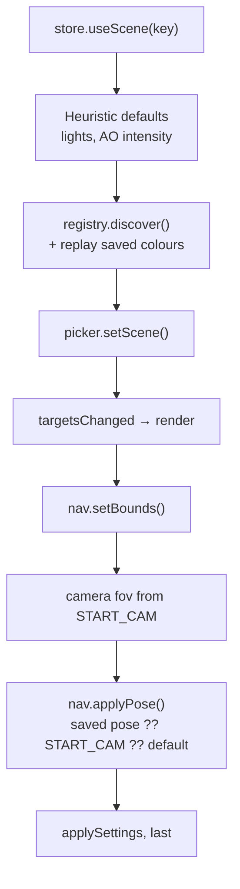
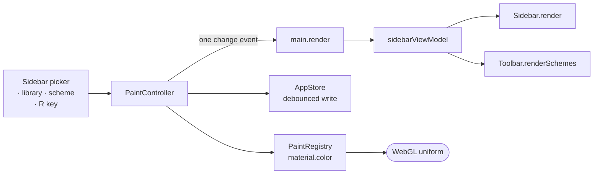

# Architecture overview

Repaint is a single-page, single-canvas app with no backend. A GLB is read in the
browser with `FileReader`, parsed by three.js, and recoloured in place. All state
persists to `localStorage`.

This document covers the components, how a colour change travels through them,
and which seams exist so the pipeline can be tested without a GPU. The reasoning
behind individual choices lives in [decisions/](decisions/).

## Components

```text
src/
  main.ts                  App: wiring, shortcuts, persistence, screenshots
  sidebarViewModel.ts      Gathers what the sidebar should show into one plain
                           object; no DOM, so it is directly assertable
  types.ts                 Shared types; PAINT_ prefix and START_CAM name
  core/
    Viewer.ts              Renderer, camera, environment, tone mapping; owns the frame loop
    FrameLoop.ts           Draws a frame only while something needs one (renderer-free)
    wakeOnInput.ts         Asks for a frame on the input that can change the picture
    SceneLoader.ts         GLB → LoadedScene, disposal, load report
    SceneSession.ts        Scene activation: prefs, discovery, picker, camera
    loaders.ts             GLTFLoader + DRACO / KTX2 / meshopt
    processScene.ts        Renderer-free: lightmap wiring, bounds, START_CAM, stats
    PaintRegistry.ts       Discovery + the single write path for material.color
    PaintController.ts     The paint fan-out: registry + store + one change event
    Picker.ts              Raycast hover/select, emissive highlight
    materials.ts           Shared material type guards
    fallbackScene.ts       Procedural demo room (also the smoke-test fixture)
  nav/
    NavigationController.ts  Mode switching, pose save/restore, pointer lock,
                             double-click focus
    WalkControls.ts          Pointer/wheel/key listeners for first-person mode
    WalkMotion.ts            DOM-free camera state machine
  state/
    store.ts               All persisted state, debounced writes
    storage.ts             localStorage + memory fallback; validating migration
  ui/                      Sidebar, ColorPicker, Toolbar, DropZone, DebugPanel,
                           HelpOverlay, StatusPanel, MobileGate, BootError, swatches
  util/                    color.ts (sRGB hex helpers), dom.ts
scripts/
  make-portable.mjs        Folds dist/ into the single-file dist/repaint.html
  bake_export.py           Headless Blender bake and .glb export (see the baking guide)
```

## How a scene becomes _the_ scene

Activation is a sequence, not a set. The constraints live in `SceneSession.load()`
and nowhere else. A caller loads a scene; it does not assemble one.


```mermaid
flowchart TD
    A["store.useScene(key)"] --> B[Heuristic defaults<br/>lights, AO intensity]
    B --> C["registry.discover()<br/>+ replay saved colours"]
    C --> D["picker.setScene()"]
    D --> E[targetsChanged → render]
    E --> F["nav.setBounds()"]
    F --> G[camera fov from START_CAM]
    G --> H["nav.applyPose()<br/>saved pose ?? START_CAM ?? default"]
    H --> I[applySettings, last]
```

Why that order:

- **The store slot first.** Everything below reads through it, and the heuristics
  write into it.
- **Discovery before the picker.** The picker builds highlight bookkeeping from
  the registry, keyed by material name, and keeps the first instance it sees for
  a key. Refreshing it while the registry still describes the previous scene
  would pin that scene's material instances under names the new one reuses.
- **Bounds before the pose.** The walk controller clamps an applied pose against
  the bounds, and the previous apartment's box is the wrong one.
- **Settings last.** This is the direction that _reads_ the store, and some of
  what it pushes can answer back. A stored eye height that walk mode has to
  clamp reports the correction straight back to the store, which writes whichever
  scene is current.

`sceneSession.test.ts` pins this order with 17 tests, so a reshuffle fails loudly.

## How a colour change travels

A colour change has to reach four places: the registry (what's on the GPU), the
store (what survives a reload), the sidebar and the toolbar. `PaintController`
owns that fan-out so no edit can do half of it.


```mermaid
flowchart LR
    UI[Sidebar picker<br/>· library · scheme<br/>· R key] --> PC[PaintController]
    PC --> REG[PaintRegistry<br/>material.color]
    PC --> ST[AppStore<br/>debounced write]
    PC -- one change event --> M[main.render]
    M --> VM[sidebarViewModel]
    VM --> SB[Sidebar.render]
    VM --> TB[Toolbar.renderSchemes]
    REG --> GPU([WebGL uniform])
```

The controller emits **one** change carrying the targets that actually moved and,
only when they went stale, the scheme rows to re-render. `main.ts` subscribes once
and updates both views from there.

That "only when stale" is what keeps a picker drag cheap: a drag fires a paint per
`pointermove`, and rebuilding the toolbar's scheme slots each time would undo the
targeted row update the sidebar just did.

Restoring saved colours after a load is the exception. It goes straight to the
registry, because `SceneSession` is _reading_ the store there and has nothing to
write back.

## Rendering the panels

The UI is plain DOM, not React. See
[ADR 0001](decisions/0001-vanilla-threejs-over-react-three-fiber.md).

The panels do diff, though, because they have to. `Sidebar` takes its whole state
as one view model and works out what moved; `Toolbar` skips a slot rebuild when
the schemes are unchanged. That is about 60 lines, not a reconciler, and it
exists so the app can re-render both panels after _every_ mutation, including on
each `pointermove` of a drag, instead of each call site remembering which half of
the UI it was supposed to touch.

Two rules keep it cheap:

- `PaintRegistry.list()` and `allMaterials()` are sorted once per discovery rather
  than per render. The sort is an `Intl` collation, and it was the whole cost.
- A section is compared against a snapshot of its _own_ contents, because the
  store mutates the objects it hands out in place.

## Frames are drawn on demand

A scene that nobody is touching draws nothing: no frames, no GPU work, no wakeups.
`FrameLoop` runs an `update` then a `draw` per frame, and asks for another frame
only if `update` says something is still moving, `invalidate()` was called, or
`keepAlive()` holds. The frame that finds nothing moving is still drawn, so what
stays on screen is always the world as the last `update` left it. The first
frame after a sleep reports a nominal 1/60 s step, not the time asleep.

What keeps it going:

- **Motion.** `NavigationController.update` and `Picker.update` return whether
  they are still moving: the camera moved since the last frame by more than a
  fraction of a pixel, a double-click retarget is under way, walk mode is waiting
  out the half second before it reports where you stopped, or a selection pulse is
  fading. Orbit also keeps going while a drag is held and after it, until the
  inertia OrbitControls holds has drained (about 150 updates): against the polar
  limit the camera does not move while that happens, so "the camera moved" alone
  would freeze the leftover and subtract it from the next drag. A damped orbit
  therefore coasts to a stop as it did when every frame was drawn, to within a
  fraction of a pixel.
- **Input.** `wakeOnInput` listens on the window, in the capture phase, so a frame
  is asked for before whatever handles the event runs: pointer down/up/click,
  wheel, keys, `input`/`change`, and a pointer moving over the canvas or with a
  button held. Passing over the sidebar changes nothing and asks for nothing.
- **State changes.** `App.render()` (which nearly every mutation ends with) and
  `applySettings()` invalidate, as does every `Viewer` setter, a resize (which
  empties the canvas) and a restored WebGL context.
- **Measuring.** `keepAlive` holds while the debug panel is open (its FPS meter is
  meaningless otherwise) and for the five seconds after a scene loads (the frame-rate
  check needs real frames).

The one rule this adds: anything that changes what the canvas shows without going
through those paths has to call `viewer.invalidate()`.

## Why recolouring is cheap

Recolouring writes `material.color` and nothing else. It never touches
`needsUpdate`, never toggles a material feature, and so never invalidates
three.js's program cache. A colour change costs one uniform upload, and dragging
the picker doesn't stutter. There is a unit test asserting `material.version`
doesn't move across colour changes.

Hover highlighting nudges `material.emissive` for the same reason: emissive is
always present in the standard-material shader. Adding an outline pass or toggling
a map would recompile on every pointer move across a wall.

Also: `devicePixelRatio` is capped at 2, and camera poses persist on a lazier
timer than everything else since they change every frame you move.

## Testable seams

`processScene.ts`, `PaintRegistry.ts`, `PaintController.ts`, `SceneSession.ts` and
`WalkMotion.ts` deliberately need no renderer. That is what lets the tests run the
real pipeline headlessly in node.

| File                       | Tests | Covers                                                                                                                                                                                                                                           |
| -------------------------- | ----: | ------------------------------------------------------------------------------------------------------------------------------------------------------------------------------------------------------------------------------------------------ |
| `smoke.test.ts`            |    34 | The fallback scene end to end: discovery, the colour write path (and refusing a colour it cannot parse), scheme capture/apply, name cleanup, persistence round-trips, library ids, ORM-vs-lightmap classification, sanitising corrupt saved data |
| `storage.test.ts`          |    27 | The localStorage backend and the store's save path: reads that write nothing, full or blocked storage, a tab that changed nothing writing nothing, two tabs each keeping what the other saved, one notice per failing episode                    |
| `navigation.test.ts`       |    23 | Orbit ⇄ walk hand-off against a stub DOM, and when the camera counts as still: a fraction of a pixel, a retarget under way, a walk stop not yet reported, orbit inertia hidden by a polar limit                                                  |
| `sceneSession.test.ts`     |    19 | The scene-activation order against a recording picker and camera, and what an import does to the walls                                                                                                                                           |
| `sidebar.test.ts`          |    19 | Which sections a render rebuilds, which it leaves standing, what survives an open colour picker, and that saved colours only ever paint a background                                                                                             |
| `frameLoop.test.ts`        |    16 | The frame scheduler on a hand-driven clock: it sleeps when nothing moves, wakes on invalidate, keeps going while asked, survives a throwing frame, and never reports the time it slept                                                           |
| `wakeOnInput.test.ts`      |    16 | Which input asks for a frame, and that it is heard before the handler that reacts to it                                                                                                                                                          |
| `viewerLoop.test.ts`       |    15 | The Viewer's frame loop against a stub renderer: every setter, resize, context restore and input asks for a frame, callbacks keep it running, and it sleeps when they stop                                                                       |
| `walk-motion.test.ts`      |    13 | Eye-height ownership, and settling: a stop is reported once                                                                                                                                                                                      |
| `sceneLoader.test.ts`      |    12 | Loading a file into the viewer scene: the swap only after a good parse, the most recent request winning, progress                                                                                                                                |
| `walkControls.test.ts`     |    12 | Walk-mode keys: movement and sprint, and browser shortcuts left alone                                                                                                                                                                            |
| `keyRepeat.test.ts`        |    11 | Ignoring the auto-repeats of a held key for one-shot shortcuts                                                                                                                                                                                   |
| `loaders.test.ts`          |     9 | What a dropped glTF may reference: only `data:` and `blob:` URLs, for the glTF loader and for KTX2 textures                                                                                                                                      |
| `paint-controller.test.ts` |     9 | The fan-out against a fake store: which walls each operation reports, that scheme rows re-render exactly when the slots change and not once more, and that a refused colour changes nothing                                                      |
| `viewerScreenshot.test.ts` |     8 | One screenshot at a time, and the pixel ratio always restored, against a fake renderer                                                                                                                                                           |
| `swatch.test.ts`           |     7 | Colours reach the DOM through the CSSOM, never as markup                                                                                                                                                                                         |
| `bootError.test.ts`        |     6 | The page shown when the app cannot start                                                                                                                                                                                                         |
| `debugPanel.test.ts`       |     6 | A hidden debug panel runs no per-frame polling and no timer, and shows current values when it is shown                                                                                                                                           |
| `viewModel.test.ts`        |     6 | The sidebar view model in plain node. Nothing from three.js leaks in, and paint rows are _snapshots_ rather than the registry's live targets                                                                                                     |
| `lazyDebugPanel.test.ts`   |     5 | The debug panel is built on first use, and ignored until then                                                                                                                                                                                    |
| `picker.test.ts`           |     5 | A selection pulse keeps the loop going until it has faded, and pointer input asks for the frame that finds what is under it                                                                                                                      |
| `disposeSubtree.test.ts`   |     4 | Freeing a scene's GPU resources, instanced meshes included                                                                                                                                                                                       |

282 tests total. The ones that need a document (`bootError`, `debugPanel`,
`keyRepeat`, `picker`, `sceneLoader`, `sidebar`, `swatch`, `viewerLoop`,
`viewerScreenshot`, `wakeOnInput` and `walkControls`) opt into happy-dom with a `@vitest-environment` docblock, so the rest of the suite stays in
plain node.

Whether `main.ts` then draws both views is browser-side and not covered. The
sidebar/toolbar seam is the next thing worth deepening.

## Debugging a live scene

In `pnpm dev`, `window.apt` is the app instance (dev-only, so the production
bundle keeps nothing alive that the UI doesn't):

```js
apt.registry.list(); // every paint target and its current hex
apt.scene.stats; // meshes, triangles, textures, compression flags
apt.viewer.renderer.info; // draw calls, geometries, programs
```

Frames are drawn on demand, so a change made from the console shows up at the next
input. Follow it with `apt.viewer.invalidate()` to see it at once.

## Decisions

- [0001: Vanilla three.js over React Three Fiber](decisions/0001-vanilla-threejs-over-react-three-fiber.md)
- [0002: Smuggle the lightmap through the occlusion slot](decisions/0002-smuggle-the-lightmap-through-the-occlusion-slot.md)
- [0003: Default lightmap intensity is π](decisions/0003-default-lightmap-intensity-is-pi.md)
- [0004: Scene state keyed by file name](decisions/0004-scene-state-keyed-by-file-name.md)
